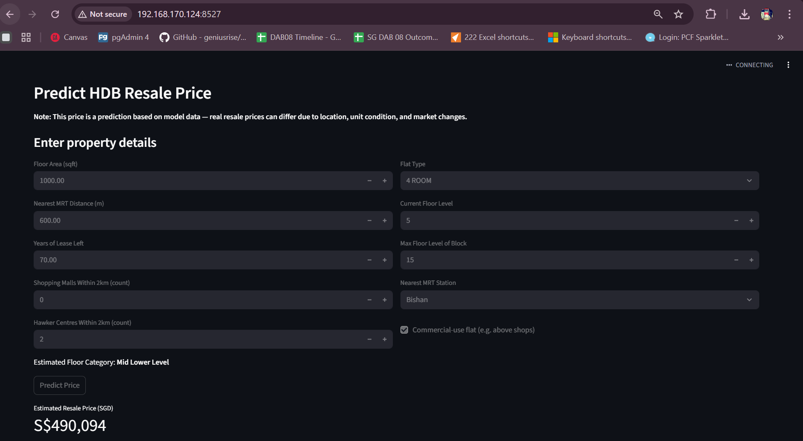
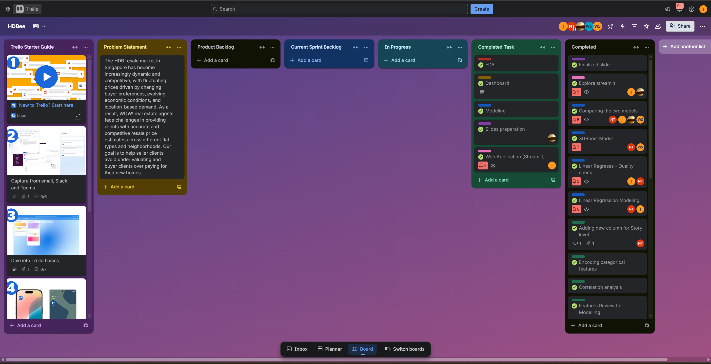

# HDB Resale Price Predictor (Group Project)

> Singapore HDB Resale Price Prediction — clean data, EDA, baseline Linear Regression vs XGBoost, feature engineering, and a minimal Streamlit app (demo).

## What this repo shows
- **Notebook**: end-to-end EDA → features → models (LR vs XGBoost) → insights.
- **Slides**: business-facing presentation and recommendations.
- **Trello**: proof of teamwork & process.
- **(Later)**: `/app` folder with Streamlit code & model.

**Data source:** Kaggle — DSI-SG Project 2 Regression Challenge (HDB Price):
https://www.kaggle.com/competitions/dsi-sg-project-2-regression-challenge-hdb-price/data

*Note:* Raw competition data is not included in this repo. Use the original train/test
splits referenced in the notebook.

## Folder guide
- `images/` screenshots (Streamlit demo hero, Trello)
- `notebooks/` Jupyter notebook (project walkthrough)
- `slides/` Final presentation deck
- `tableau/` (optional) TWBX files for EDA dashboards
- `data/` placeholder only (no raw data committed)
- `app/` to be added later (Streamlit)

## How to view
1. Open `notebooks/Project3_DataSprint_GroupB_Final.ipynb` in Jupyter/VS Code.
2. View the deck in `slides/*.pptx`.
3. Data is excluded. Use the original Kaggle train/test splits referenced in the notebook.

## Credits
Team B — Weng Seng, Efdy, Nathaniel, Shadni, Myo Myint Aung (Jimmy).

